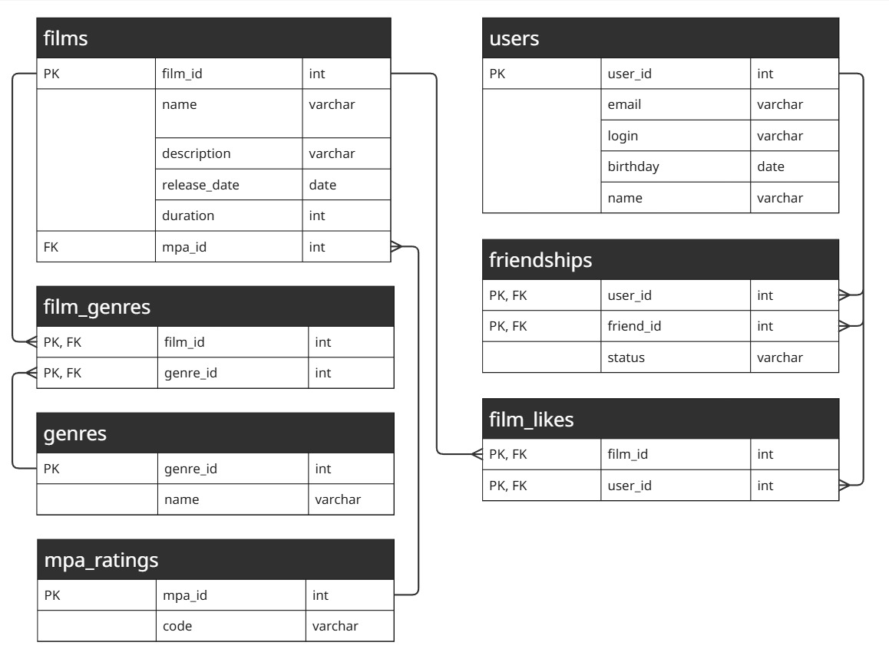

# java-filmorate
Приложение для рекомендации фильмов и работы с оценками пользователей. 

# Основные возможности:
  - Базовый функционал: добавление, поиск, обновление и удаление фильмов
  - Лайки: система оценок для формирования рейтинга 
  - Социальная сеть: друзья 
  - Каталогизация: жанры и рейтинги MPA
  - Топ-подборки: самые популярные фильмы

# Схема базы данных

